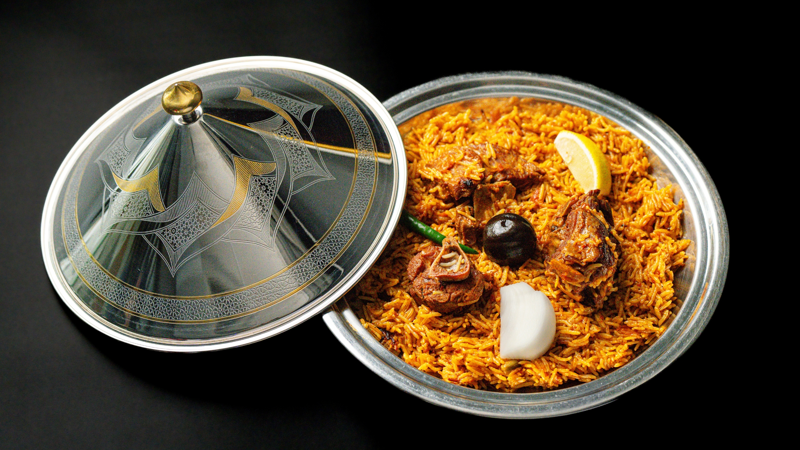

# مطعم الملقى | Al-Malqa Restaurant

🍽️ **Premium Arabic Restaurant Website** - Doha, Qatar

A modern, fast, and SEO-optimized single-page website for Al-Malqa Restaurant, built with Astro and Tailwind CSS.



## ✨ Features

- **Single Page Application** - Smooth scroll navigation
- **Responsive Design** - Mobile-first approach
- **Arabic & English** - Bilingual support with RTL text
- **SEO Optimized** - Arabic keywords, structured data (JSON-LD)
- **Social Media Ready** - OG tags for WhatsApp, Facebook, Twitter link previews
- **Interactive Hero** - Scroll-triggered dish carousel with auto-rotation
- **Delivery Partners** - Integrated links to Keeta, Talabat, Snoonu, Rafeeq, Deliveroo
- **WhatsApp Ordering** - Quick order via WhatsApp

## 🥘 Signature Dishes

- **مضغوط دجاج** - Madghut Chicken
- **مضغوط لحم** - Madghut Lamb  
- **مضغوط حاشي** - Madghut Hashi (Camel)

## 🛠️ Tech Stack

- [Astro](https://astro.build/) v5.16.6 - Static Site Generator
- [React](https://react.dev/) - Interactive Components
- [Tailwind CSS](https://tailwindcss.com/) v4 - Styling
- [Framer Motion](https://www.framer.com/motion/) - Animations

## 📁 Project Structure

```
/
├── public/
│   ├── images/
│   │   ├── menu/           # Menu item images
│   │   ├── partners/       # Delivery partner logos
│   │   └── story/          # Story section images
│   └── fonts/
├── src/
│   ├── components/
│   │   ├── HeroSection.astro
│   │   ├── RotatingDishes.tsx
│   │   ├── BentoMenuGrid.astro
│   │   ├── OrderLinks.astro
│   │   ├── StorySection.astro
│   │   ├── Navigation.astro
│   │   ├── Footer.astro
│   │   └── SEO.astro
│   ├── layouts/
│   │   └── BaseLayout.astro
│   ├── pages/
│   │   └── index.astro
│   └── styles/
│       └── global.css
└── package.json
```

## 🚀 Getting Started

```bash
# Install dependencies
npm install

# Start development server
npm run dev

# Build for production
npm run build

# Preview production build
npm run preview
```

## 🎨 Brand Colors

| Color | Hex | Usage |
|-------|-----|-------|
| Maroon | `#770e1d` | Primary |
| Desert Sand | `#E5C5A1` | Background |
| Carrot | `#DD9528` | Accent |
| Licorice | `#1f0d0b` | Text |

## 📍 Location

**St 340, Salwa Road, Doha, Qatar**

- Phone: +974 7107 8400
- Instagram: [@almalqa.qa](https://www.instagram.com/almalqa.qa/)
- TikTok: [@almalqa.qa](https://www.tiktok.com/@almalqa.qa)
- Facebook: [Al-Malqa](https://www.facebook.com/almalqa.qa)

## 🕐 Opening Hours

- **Sun - Thu & Sat:** 11:00 AM - 11:30 PM
- **Friday:** 12:15 PM - 11:30 PM

## 📄 License

© 2026 Al-Malqa Restaurant. All rights reserved.

---

Made with ❤️ in Qatar
